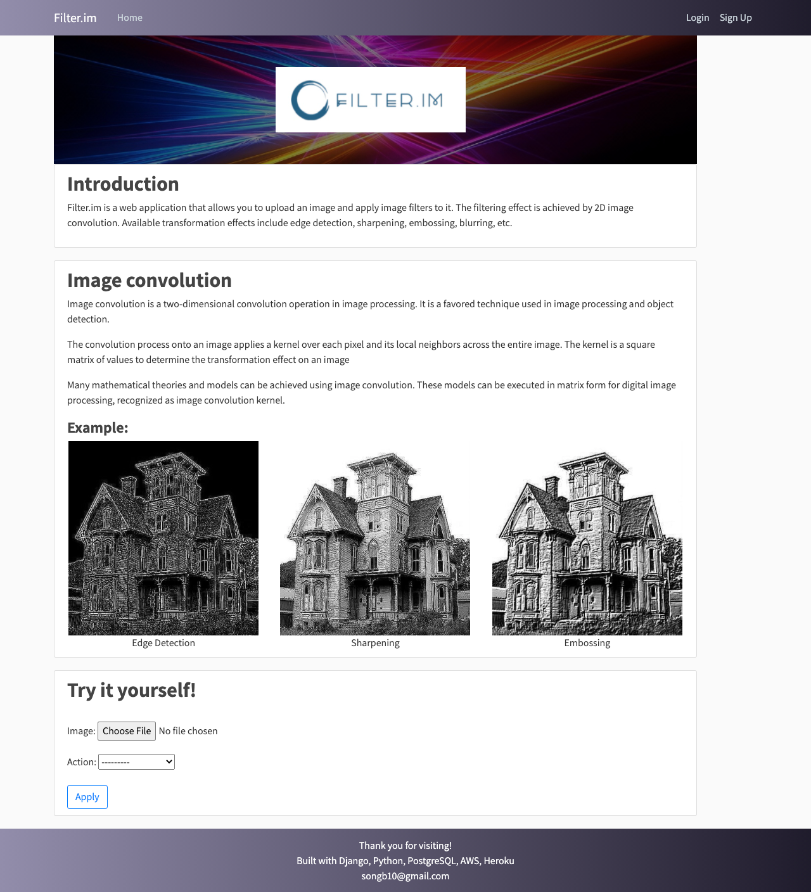
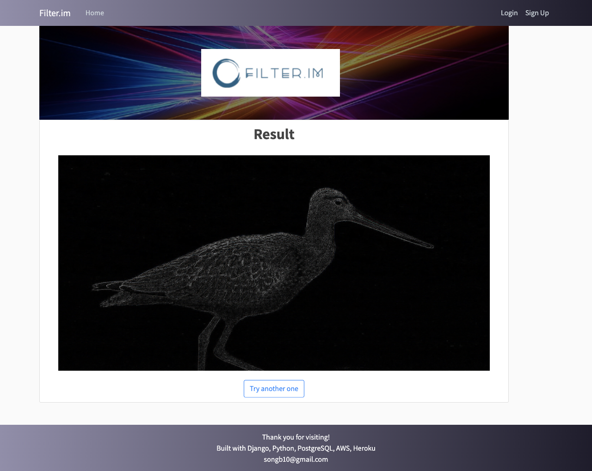

# FilterMe
Image filtering applications built with Django, Python, PostgreSql, AWS S3, and Heroku

## About
Filter.im is a web application that allows you to upload an image and apply image filters to it. 
The filtering effect is achieved by 2D image convolution. Available transformation effects include edge detection, sharpening, embossing, blurring, etc.

## Deployment
Link: https://www.filter-im.herokuapp.com
*Note This web application is no longer available on the internet

## Website content
Home page:
 

Apply edge detection effect to this image:
 

 
source: https://www.dailysabah.com/life/environment/bird-sets-world-record-for-longest-nonstop-flight-from-alaska-to-new-zealand

Result:
 

